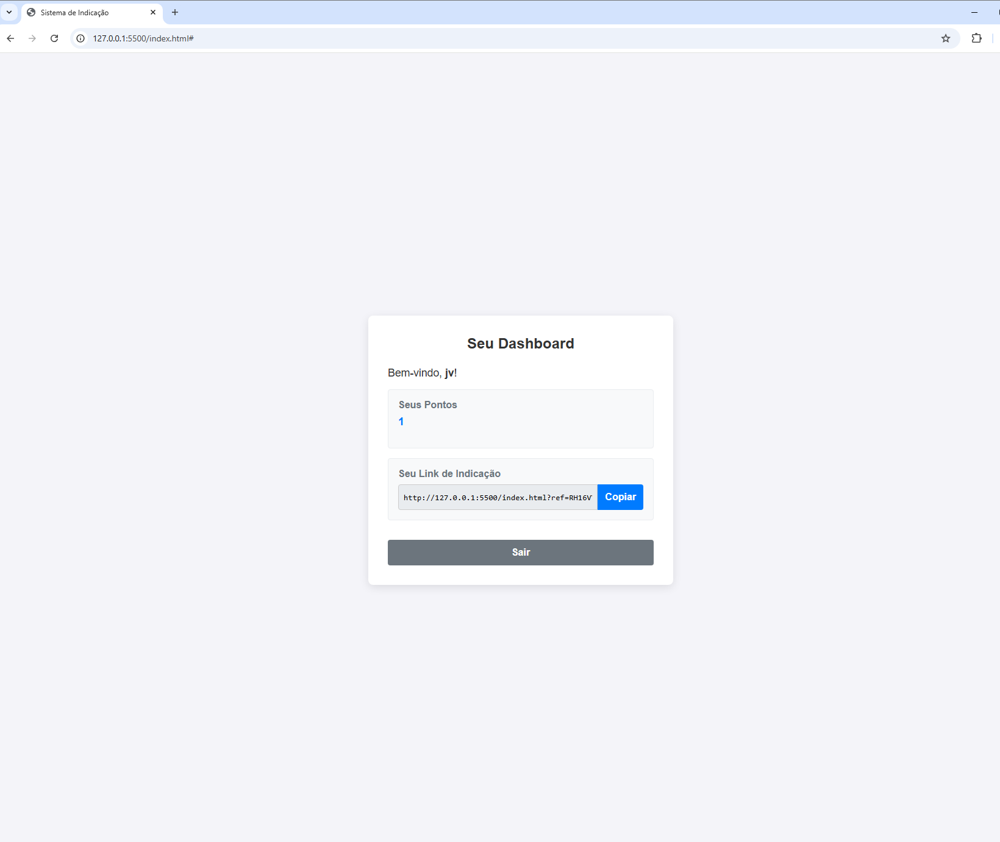

# 🌟 Sistema de Indicação (Referral System)


Uma aplicação **SPA (Single Page Application)** construída do zero, que implementa um sistema de cadastro de usuários e **pontuação por indicação**.  
Este projeto foi desenvolvido como parte de um **desafio técnico**.

---

## 📸 Screenshot


---

## 🎯 Funcionalidades

- **Cadastro de Usuários:** Formulário para registro de novos usuários com validação no front-end.  
- **Login Seguro:** Autenticação de usuários com senhas criptografadas e tokens JWT.  
- **Dashboard (Perfil):** Exibe nome do usuário, pontuação atual e link de indicação único.  
- **Sistema de Indicação:** Usuários ganham **+1 ponto** para cada novo cadastro feito com seu link.  
- **Copiar Link:** Botão prático para copiar o link de indicação para a área de transferência.  

---

## 🛠️ Tecnologias Utilizadas

### Back-end
- **Node.js** → Ambiente de execução JavaScript no servidor.  
- **Express.js** → Framework minimalista para construção da API REST.  
- **SQLite** → Banco de dados leve baseado em arquivo, simples de configurar.  
- **bcrypt.js** → Criptografia de senhas com hashing seguro.  
- **jsonwebtoken (JWT)** → Autenticação stateless via tokens.  

### Front-end
- **HTML5, CSS3 e JavaScript (Vanilla JS)** → Construção do front sem frameworks pesados, demonstrando domínio das tecnologias base.  
- **CSS Flexbox** → Layout moderno e responsivo.  
- **Fetch API** → Comunicação assíncrona com o back-end.  

---

## 🚀 Instalação e Execução

### Pré-requisitos
- Node.js (versão LTS recomendada)  
- Git  
- VS Code (opcional, mas recomendado)  

### Passos

1. **Clone o repositório:**
   ```bash
   git clone https://github.com/Dimitri7/sistema-de-indicacao.git
Navegue até o diretório:

bash
Copiar código
cd sistema-de-indicacao-spa
Instale as dependências do back-end:

bash
Copiar código
npm install
Inicie o servidor:

bash
Copiar código
npm start
O servidor estará rodando em http://localhost:3000.

Abra o front-end:

No VS Code, clique com o botão direito no arquivo index.html.

Escolha "Open with Live Server".

A aplicação abrirá no navegador (exemplo: http://127.0.0.1:5500).

🤖 Colaboração com IA
Durante o desenvolvimento, utilizei um assistente de IA como mentor técnico, que me auxiliou em:

Estruturação do Projeto: Criação de uma arquitetura organizada em MVC (models, controllers, routes).

Geração de Código + Explicação: Implementação de funcionalidades acompanhada de explicações detalhadas sobre CORS, JWT, bcrypt, Fetch API, etc.

Debugging Interativo: Resolução de erros em tempo real (git, fetch, sintaxe, etc.).

Aprendizado Prático: Compreensão profunda do "porquê" de cada decisão técnica.

A experiência foi equivalente a ter um programador sênior disponível 24/7, o que acelerou meu aprendizado e melhorou a qualidade do projeto.

👨‍💻 Autor
Feito com ❤️ por Dimitri Albuquerque

GitHub:(https://github.com/Dimitri7)

LinkedIn:(https://www.google.com/search?q=https://www.linkedin.com/in/dimitri-albuquerque-66b32b278)
